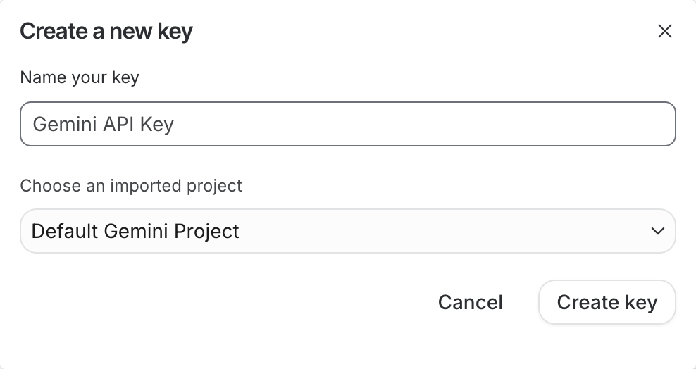
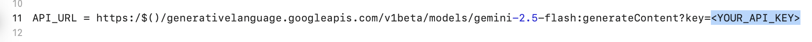

# ios-group5: SaveSync

[GitHub repo URL](https://github.com/edenfdo/ios-group5)

Daily calendar expense tracker

## Instructions for running locally

Prior to running the app in XCode, there are some additional setup instructions required due to the use of Google Gemini for the chatbot feature.

1. Navigate to [Google AI Studio - API Keys](https://aistudio.google.com/api-keys) and click "Create API key".

1. Copy the API key.
2. Open the XCode project (`Group5/Group5.xcodeproj`) in XCode.
3. Navigate to `Group5/Group5/Development.xcconfig` and paste your API key in place of `<YOUR_API_KEY>`.

4. Build and run the app on your chosen device.

## Features

Home Page:
1. Should show daily expenses and monthly budget remain (budget amount should be set by user in Budget page)
2. A big "Plus" icon will show the first time user opened the app, they will be able to set their goal to save the money from budget for something and choose some icon. Then every monthly remaining budget will be add up into the goal automatically.
3. A calender should show which will record every day expenses, it will show colours from e.g white to red meaning percentage of your expense this over this month.
4. when click into a date in the calender it should show pop-up page showing that day's expense and notes

Add Expense Page: 
1. User should be able to choose the date they want to add this expense
2. An user textfield that can enter the amount of money
3. Categories for user to choose
4. User could enter in the note for this particular expense to explain what was this for (Optional)
5. After user entered the amount and choose the category, then the save button will turn orange, then user could press to save this expense. 

Budget Page: 
1. User could press the "Set Monthly Budget" button with a pop-up page to set their monthly budget and category budget.
2. Will show the monthly budget and category budget limit with bars visualising percentage.
3. User could choose which category to add budget, if they didn't add any limit for a category, then no limit for this category.
4. If the Icon is already chosen, then icon should turn grey and cannot be selected.

Analytics Page:
1. This page should show the total spend of this year and how many expenses the user spent.
2. A chart will be showing each month's total expenses, any month that hasn't reach yet will leave as zero.
3. The expenses will show in alphabetical orders of total expenses this year in categories, and each category show the total expenses in this year. 